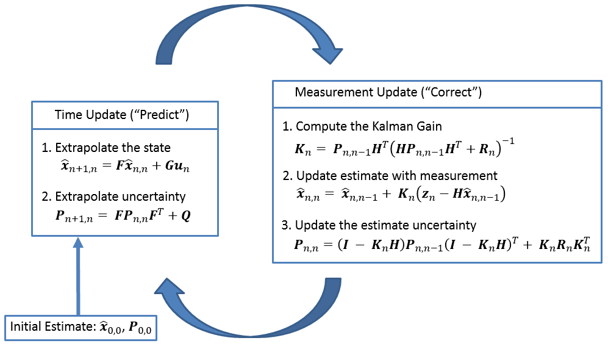

# Pose Estimation of Aruco Marker with Kalman Filter
Solution of Pose estimation problem for aruco marker with a Kalman Filter.

```
pose-estimation-kalman
├── include
│   ├── calib_data.npz
│   ├── definitions.py
│   ├── parameters.py
│   └── utils.py
├── src
│   ├── controller.py
│   ├── motor.py
│   ├── sfm.py
│   └── VisionKalmanFilter.py
├── main_vehicle.py
├── calibration.py
└── README.md
```

## Calibration of Camera
The first thing to do to use this filter is to make sure you get a proper matrix of the chamber's intrinsic parameters.
In this project, the [Charuco Board calibration technique](https://docs.opencv.org/4.7.0/da/d13/tutorial_aruco_calibration.html) was used.
```
python3 calibration.py
```
the data obtained are saved in the following format in a npz file.
```
{
    camera_matrix, 
    dist_coeffs, 
    rvecs, 
    tvecs
}
```

## Kalman Filter for Vision Purpose
A simple Kalman Filter is based on two steps, `update` and `prediction`.
<p align="center">
    
</p>

In this project aims to improve the acquisition of aruco markers. 
Therefore, the matrices were modeled in the `set_vision_mode` method.
This modeling was taken from the following [paper](https://www.researchgate.net/publication/327191584_An_Improvement_on_ArUco_Marker_for_Pose_Tracking_Using_Kalman_Filter),
```
@inproceedings{
    inproceedings,
    author = {Kam, Ho Chuen and Yu, Ying and Wong, Kin-hong},
    year = {2018},
    month = {06},
    pages = {65-69},
    title = {An Improvement on ArUco Marker for Pose Tracking Using Kalman Filter},
    doi = {10.1109/SNPD.2018.8441049}
}
```

The main goals are two:
- signal cleaning during marker tracking;
- signal prediction by reconstructing part of the missing signal.

### Signal Cleaning
Marker tracking is affected by noises due to various environmental perturbations (air, water, etc.). 
So it is necessary for the filter to clean the video signal from these noises.

<p align="center">
    
</p>

### Signal Prediction
Sometimes, the video signal is lost due to a temporary obstacle, such as an alga passage in the case of a 
marine environment. This does not necessarily mean that we are in front of an obstacle, 
but that the video signal must be predicted to move forward.

<p align="center">
    
</p>


## Application
I simulated a possible application with a finite state machine that you can find in `main_vehicle.py` file.
```
[ KF ]: start
[ KF ]: F,H,Q,R setted
---------------------------------
[ CAMERA NODE ]
[ ARUCO NODE ]
[ REFGEN NODE ]
[ REFGEN ]: parsing ids = [], corners = ()
[ REFGEN ]: OFF STATE
[ CONTROL NODE ]
[ CONTROL ]: parsing theta = 0.0, d = 0.0
[ MOTOR NODE ]
[ MOTOR ]: parsing cmd = COMMAND.stop, speed = 0.4
[ MOTOR NODE ]: speed = 0.0 
---------------------------------
```
If you are interested in a real application of this filter, 
you can see this [repository](https://github.com/AngeloDamante/trylo_core.git) where 
I implemented a vision control system on ros2 in a real vehicle!